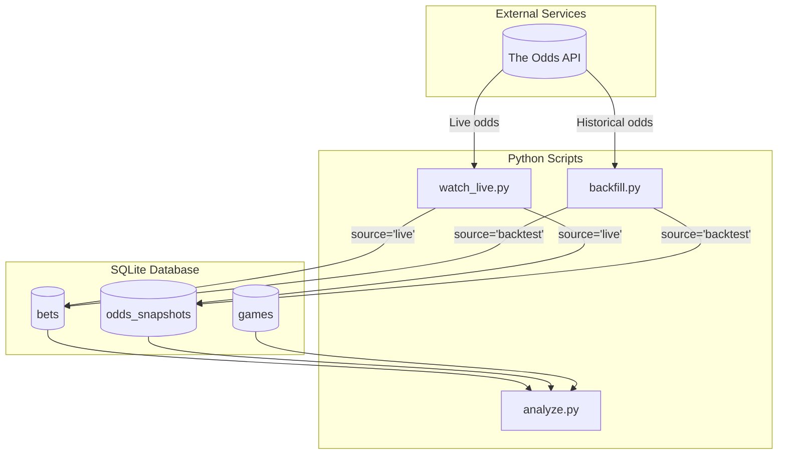
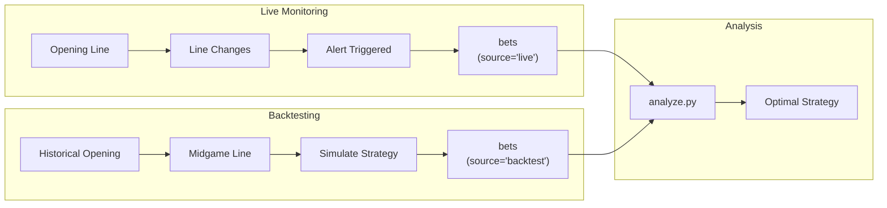
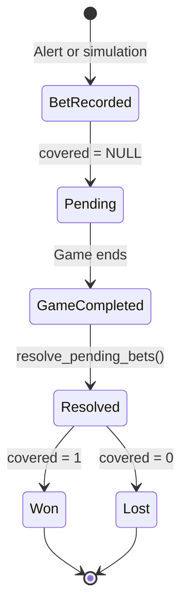

# Data Flow Architecture

## High-Level System Overview (Simplified)

## Data Sources & Destinations

| Script | Reads From | Writes To |
|--------|-----------|-----------|
| watch_live.py | API (live odds) | `odds_snapshots`, `bets`, `games`, `alerts` |
| backfill.py | API (historical) | `odds_snapshots`, `bets`, `games`, `game_results` |
| analyze.py | Database only | Terminal output (no writes) |

## Unified Bet Flow

## How Data Flows for Strategy Testing

1. **Collect Data** (two sources)
   - `watch_live.py` monitors real games → records bets with `source='live'`
   - `backfill.py` analyzes historical games → records bets with `source='backtest'`

2. **Unified Storage**
   - Both sources write to the same `bets` table
   - The `source` column distinguishes live vs backtest data

3. **Analysis**
   - `analyze.py` reads ALL bets from the unified table
   - Tests threshold strategies across combined dataset
   - Finds optimal parameters that work for both live and historical data

## Bet Resolution Flow

## Key Design Decisions

### Why Unified Tables?

**Before (v1):** 9 tables with overlapping purposes
- `opening_odds` + `odds_history` + `line_snapshots` all stored odds
- `bet_outcomes` + `simulated_bets` both stored bet records
- Analysis required complex queries joining multiple tables

**After (v2):** 5 core tables with clear purposes
- `odds_snapshots` - ALL odds data with `source` and `snapshot_type` fields
- `bets` - ALL bets with `source` field to distinguish live vs backtest
- Simpler queries, cleaner data flow

### Backwards Compatibility

During migration:
- Legacy tables are preserved
- New writes go to BOTH old and new tables
- Old code continues to work
- New code uses unified tables
