# Data Flow Architecture

## High-Level System Overview

## Live Monitor Flow (watch_live.py)

```mermaid
sequenceDiagram
    participant User
    participant Script as watch_live.py
    participant API as The Odds API
    participant DB as SQLite
    participant Tracker as HistoricalTracker

    User->>Script: Run monitor
    
    loop Every 2 minutes
        Script->>API: Get live odds
        API-->>Script: Games + spreads
        
        loop Each game
            Script->>DB: Check opening_odds exists?
            alt No opening line
                Script->>DB: Save to opening_odds
                Script->>Tracker: record_opening_line()
                Tracker->>DB: Save to line_snapshots
            end
            
            Script->>Script: Calculate % change
            
            alt Change >= threshold
                Script->>DB: Save alert
                Script->>Tracker: record_alert()
                Tracker->>DB: Save to bet_outcomes
                Script->>User: Print alert! 🚨
            end
        end
        
        Script->>Script: Sleep 2 min
    end
```

## Historical Backfill Flow (historical_backfill.py)

## Analysis Flow (analyze_bets.py)

## Bet Resolution Flow

