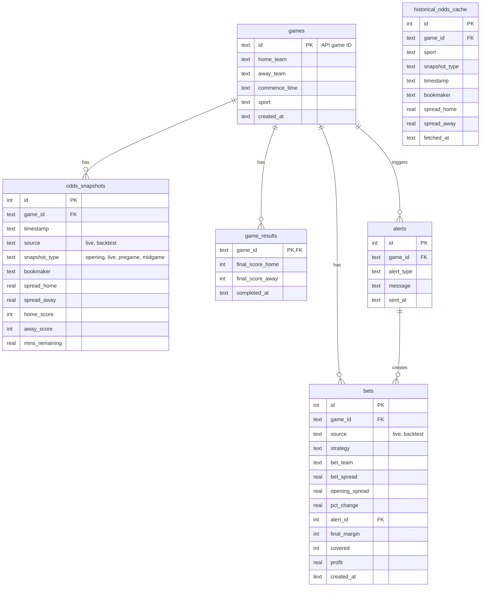

# Database Schema

## Schema v2 (Consolidated)

The schema has been consolidated to reduce redundancy and simplify data flow:

| Before (9 tables) | After (5 core tables) |
|---|---|
| `opening_odds`, `odds_history`, `line_snapshots` | → `odds_snapshots` |
| `bet_outcomes`, `simulated_bets` | → `bets` |
| `games`, `game_results`, `alerts`, `historical_odds_cache` | unchanged |

## Entity Relationship Diagram

## Table Purposes

| Table | Purpose | Written By | Read By |
|-------|---------|------------|---------|
| `games` | Core game registry | All scripts | All scripts |
| `game_results` | Final scores | Both scripts | analyze.py |
| `odds_snapshots` | **All odds** (opening + live + backtest) | watch_live.py, backfill.py | Analysis |
| `bets` | **All bets** (live + backtest) | watch_live.py, backfill.py | analyze.py |
| `alerts` | Triggered alerts | watch_live.py | Analysis |
| `historical_odds_cache` | Cached API responses (saves credits) | backfill.py | backfill.py |

## Key Fields

### \`bets.source\`
- \`'live'\` - Bet recorded during live monitoring  
- \`'backtest'\` - Bet simulated from historical data

### \`odds_snapshots.snapshot_type\`
- \`'opening'\` - First recorded odds
- \`'live'\` - Real-time odds during game
- \`'pregame'\` - Odds at game start (backtest)
- \`'midgame'\` - Odds at halftime-ish (backtest)

## Migration

The database automatically migrates from v1 to v2 on first run:
- Existing data from legacy tables is copied to unified tables
- Legacy tables are preserved for backwards compatibility
- New writes go to both old and new tables during transition

## Key Relationships

1. **games** is the central table - all other tables reference it via \`game_id\`
2. **bets** can optionally link to an **alert** that triggered the bet
3. **historical_odds_cache** uses \`UNIQUE(game_id, snapshot_type, bookmaker)\` to prevent duplicate API calls
