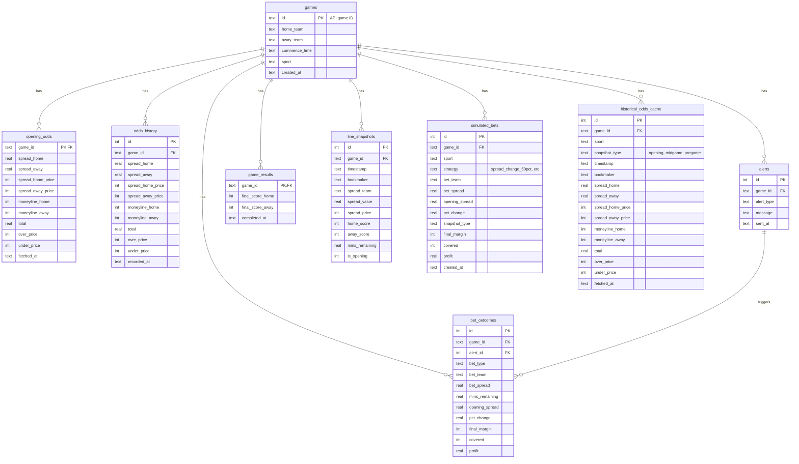

# Database Schema

## Entity Relationship Diagram

## Table Purposes

| Table | Purpose | Written By | Read By |
|-------|---------|------------|---------|
| `games` | Core game registry | All scripts | All scripts |
| `opening_odds` | First recorded odds | watch_live.py | watch_live.py |
| `odds_history` | All odds snapshots over time | watch_live.py | Analysis |
| `alerts` | Record of triggered alerts | watch_live.py | Analysis |
| `game_results` | Final scores | Both | analyze_bets.py |
| `line_snapshots` | Live line movements | watch_live.py | Analysis |
| `bet_outcomes` | Live monitor bets | watch_live.py | analyze_bets.py |
| `historical_odds_cache` | Cached API responses | historical_backfill.py | historical_backfill.py |
| `simulated_bets` | Backfill simulated bets | historical_backfill.py | analyze_bets.py |

## Key Relationships

1. **games** is the central table - all other tables reference it via `game_id`
2. **bet_outcomes** can optionally link to an **alert** that triggered the bet
3. **historical_odds_cache** uses `UNIQUE(game_id, snapshot_type, bookmaker)` to prevent duplicate API calls
