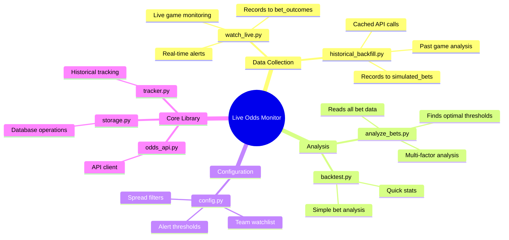
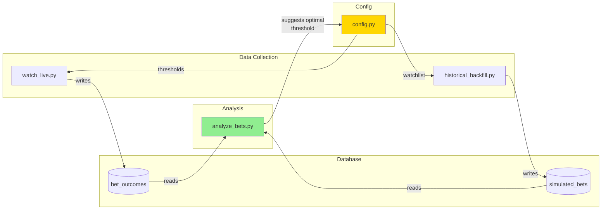
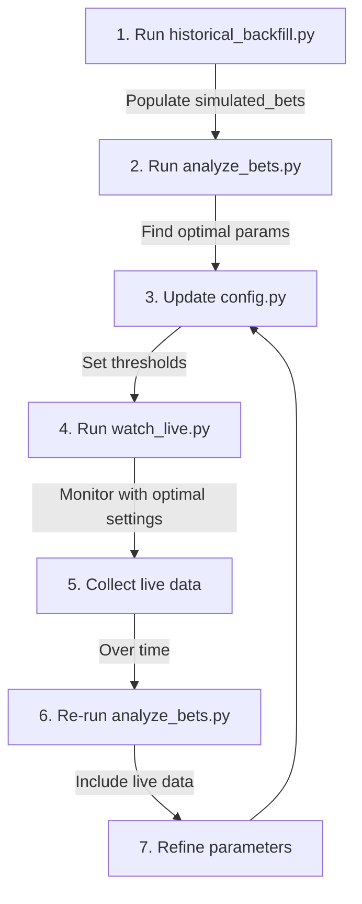

# Script Reference

## Overview



## Script Details

### watch_live.py

**Purpose:** Monitor live games and alert on spread changes

**Data Written:**
| Table | Data |
|-------|------|
| `games` | New games discovered |
| `opening_odds` | First odds seen |
| `odds_history` | All odds snapshots |
| `alerts` | Triggered alerts |
| `line_snapshots` | Live line movements |
| `bet_outcomes` | Hypothetical bets |

**Key Functions:**
```
main()
└── poll_loop()
    ├── client.get_live_odds()
    ├── storage.save_game()
    ├── storage.save_opening_odds()
    ├── tracker.record_opening_line()
    ├── check_for_alerts()
    │   └── tracker.record_alert()
    └── sleep(poll_interval)
```

---

### historical_backfill.py

**Purpose:** Fetch historical games and simulate betting strategies

**Data Written:**
| Table | Data |
|-------|------|
| `games` | Historical games |
| `game_results` | Final scores |
| `historical_odds_cache` | Cached API responses |
| `simulated_bets` | Strategy simulations |

**Key Functions:**
```
main()
├── get_completed_games()
├── fetch_historical_odds_for_game()
│   ├── check_cache()
│   └── client.get_historical_odds()
├── simulate_bets_for_game()
│   └── test_all_thresholds()
└── print_strategy_analysis()
```

**API Credit Usage:**
- Scores endpoint: Free
- Historical odds: 10 credits per call
- Uses cache to avoid duplicate calls

---

### analyze_bets.py

**Purpose:** Analyze all bet data to find optimal parameters

**Data Read:**
| Table | Source |
|-------|--------|
| `simulated_bets` | Historical backfill |
| `bet_outcomes` | Live monitor |

**Analysis Types:**
1. **Threshold Optimization** - Find best % change
2. **Spread Size Analysis** - Small/Medium/Large
3. **Bet Direction** - Favorites vs Underdogs
4. **Line Movement** - Toward favorite/underdog
5. **Margin Analysis** - How close are losses?
6. **Multi-Factor** - Combine all filters

**Key Functions:**
```
main()
├── load_all_bets()
│   ├── query simulated_bets
│   └── query bet_outcomes
├── analyze_by_threshold()
├── analyze_by_spread_size()
├── analyze_by_bet_direction()
├── analyze_by_line_movement_direction()
├── analyze_margin_of_victory()
├── analyze_combined_filters()
└── suggest_optimal_strategy()
```

---

## Relationships Between Scripts



## Typical Workflow


